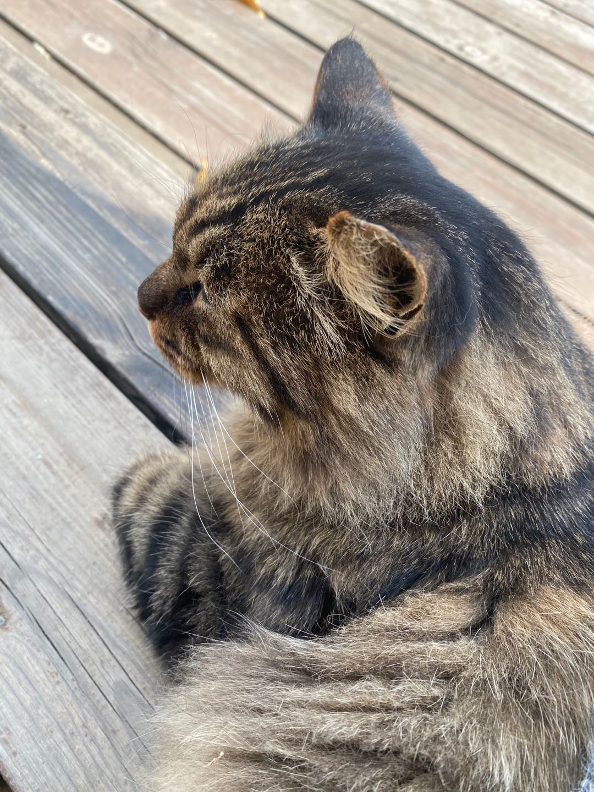

# This is Jeff's awesome website

 Can I add some text here ...?


## Here's a subtitle

Add here's additional text

```{r}
rnorm(10)
```

# Links

Let's link to useful tools for data science

* [Google](https://www.google.com/)
* [P8105](https://p8105.com)

# Local image

Here is a cat I met yesterday:



# Link to page within the site

[About Me](about_me.html)